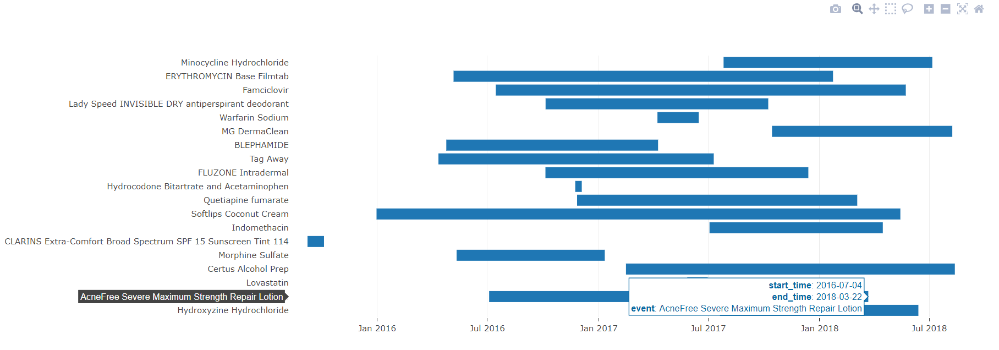

manyamPlotlyTimeline
----------------------

### Plotly javascript workaround to generate timeline view using bar charts



Why manyamPlotlyTimeline exists -
1. Plotly which is awesome in itself hasn't yet developed a timeline view but provides great interactivity such as zoom, tootlips, chart download and much more. Refer [plotly](https://plot.ly/javascript/) for more information.
2. Creating a new timeline takes effort and is time consuming.

Getting started
--------------

#### Download

Download the zip file from GitHub and include it in your project.

#### Add all the required files

Refer index.html and refer all the required files into your HTML file. Do not forget to include plotly!

#### Add a div element with id. This is where the plot is generated.

```html
<div id='timelinePlot'></div>
```

#### Initialize the plugin
```javascript
var timeline = new ManyamPlotlyTimeline('timelinePlot');
```
#### Sample data
```json
data = [
{
    "start_time": "2018-06-13",
    "end_time": "2017-07-20",
    "event": "Hydroxyzine Hydrochloride"
},
{
    "start_time": "2016-07-04",
    "end_time": "2018-03-22",
    "event": "AcneFree Severe Maximum Strength Repair Lotion"
}]
```

#### Call generateTimelinePlot method on the object create the grid
```javascript
var params = {
    data: data,
    startTimeKey: 'start_time',
    endTimeKey: 'end_time',
    labelKey: 'event',
    toolTipKeys: ['start_time', 'end_time', 'event']
};
timeline.generateTimelinePlot(params);
```

That's it!
